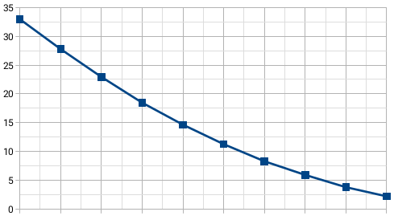

<h1 align="center">
    
</h1>

  <a href="#-projeto">Projeto</a>
  &nbsp;&nbsp;&nbsp;|&nbsp;&nbsp;&nbsp;
  <a href="#-resultados">Resultados</a>

## ✦ Projeto

A atividade prática tem como objetivo a implementação da versão <b>Steepest Ascent</b> da heurística vista em sala denominada Hill-Climbing, que se baseia em um método de busca local que usa um procedimento de melhoria iterativa. A ideia geral é verificar novas soluções candidatas na região da solução corrente (atual) e aceitar novas soluções caso sejam melhores.

<b>O algoritmo foi projetado para minimização.</b>

O algoritmo foi implementado em cima de duas funções matemáticas. Sendo a primeira a <b>Função Quadrática</b>, uma função matemática simples onde o gráfico dessa é uma simples parábola. A segunda função implementada é conhecida como <b>Função de Ackley</b>, que possui um gráfico mais complexo, esse é exibido a seguir.

    

## ✦ Resultados
#### Função Quadrática

Os resultados foram obtidos, tendo como base uma perturbação de até 5%. Para a inicialização um valor entre os limites (-10, 10) era aleatoriamente definido e o algoritmo realizaria uma busca local sendo limitado a 10 iterações e tendo um total de 30 amostras.

    

#### Função Quadrática

Os resultados foram obtidos, tendo como base uma perturbação de até 5%. Para a inicialização um valor entre os limites (-5, 5) era aleatoriamente definido e o algoritmo realizaria uma busca local sendo limitado a 10 iterações e tendo um total de 30 amostras.

    

---

O projeto foi desenvolvido, para fins didáticos, durante a disciplina de Meta-heurísticas do curso de Bacharelado em Ciência da Computação da UFV – Campus Florestal

